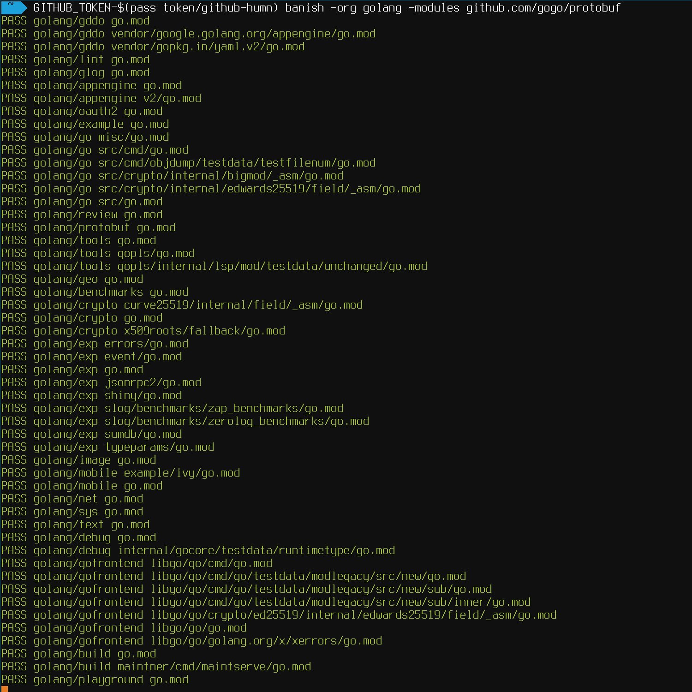

<!--
    Code for this README is largely from othneildrew's template, see the original repo and relevant
    license here: https://github.com/othneildrew/Best-README-Template
-->

<a name="readme-top"></a>


<br />
<div align="center">
  <a href="https://github.com/humn-ai/banish">
    
  </a>

  <h3 align="center">Banish</h3>

  <p align="center">
    A Go tool for scanning organisation repositories for blacklisted modules
    <br />
    <br />
    <a href="https://github.com/humn-ai/banish/issues">Report Bug</a>
    ·
    <a href="https://github.com/humn-ai/banish/issues">Request Feature</a>
  </p>
</div>


<!-- TABLE OF CONTENTS -->
<details>
  <summary>Table of Contents</summary>
  <ol>
    <li><a href="#about-the-project">About The Project</a></li>
    <li><a href="#installation">Installation</a></li>
    <li><a href="#usage">Usage</a></li>
    <li><a href="#contributing">Contributing</a></li>
    <li><a href="#license">License</a></li>
    <li><a href="#contact">Contact</a></li>
  </ol>
</details>


<!-- ABOUT THE PROJECT -->
## About The Project

<div align="center">
    
</div>

When maintaining lots of repos, it is often necessary to find a list of repos containing modules that have out-of-date dependencies. This tool will scan all of an organisation's repos looking for go.mod files, and will parse those files looking for modules that need to be removed or updated.

Here's why:
* You have updated a module with a breaking change, and want to ensure that all projects that depend upon it have been updated
* You have identified a security, license, or some other issue with a dependency and with to make sure that none of your repos depend upon it (including at least one step indirectly)
* You have tried to use GitHub's search to help find these issues and value your sanity enough to use some proper tooling instead :smile:

<p align="right">(<a href="#readme-top">back to top</a>)</p>


<!-- GETTING STARTED -->
## Installation

Use `go install`.

```bash
go install github.com/humn-ai/banish@latest
```

<p align="right">(<a href="#readme-top">back to top</a>)</p>


<!-- USAGE EXAMPLES -->
## Usage

Running `banish` without any arguments will output usage information.

A simple scan of all repositories might look like this:

```bash
banish -github-token <your token> -org humn-ai -modules github.com/gogo/protobuf
```

Multiple repositories can be provided with CSV, and minimum versions can be provided with @:

```bash
banish \
    -github-token <your token> \
    -org humn-ai \
    -modules github.com/gogo/protobuf,github.com/rs/zerolog@1.0.0
```

To use a file with a line for each entry to search for, standard POSIX comes in handy. Also note that an environment variable of `GITHUB_TOKEN` can be used to improve the security of your token handling. Here `pass` is used to store a token encrypted and avoid leaving it laying around in terminal history or environment variables, and a line-by-line blacklist file is converted to CSV:

```bash
GITHUB_TOKEN=$(pass tokens/github-ro) banish \
    -org humn-ai \
    -modules $(cat blacklist.txt | tr '\n' ',')
```

<p align="right">(<a href="#readme-top">back to top</a>)</p>


<!-- CONTRIBUTING -->
## Contributing

Contributions are what make the open source community such an amazing place to learn, inspire, and create. Any contributions you make are **greatly appreciated**.

If you have a suggestion that would make this better, please fork the repo and create a pull request. You can also simply open an issue.
Don't forget to give the project a star! Thanks again!

1. Fork the Project
2. Create your Feature Branch (`git checkout -b feature/AmazingFeature`)
3. Commit your Changes (`git commit -m 'Add some AmazingFeature'`)
4. Push to the Branch (`git push origin feature/AmazingFeature`)
5. Open a Pull Request

<p align="right">(<a href="#readme-top">back to top</a>)</p>


<!-- LICENSE -->
## License

Distributed under the MIT License. See `LICENSE.txt` for more information.

<p align="right">(<a href="#readme-top">back to top</a>)</p>


<!-- CONTACT -->
## Contact

Project Link: [https://github.com/humn-ai/banish](https://github.com/humn-ai/banish)

Humn - [https://www.humn.ai](https://www.humn.ai)

John Anthony - [https://jo.hnanthony.com](https://jo.hnanthony.com) - john.anthony@humn.ai, john@jo.hnanthony.com

<p align="right">(<a href="#readme-top">back to top</a>)</p>
